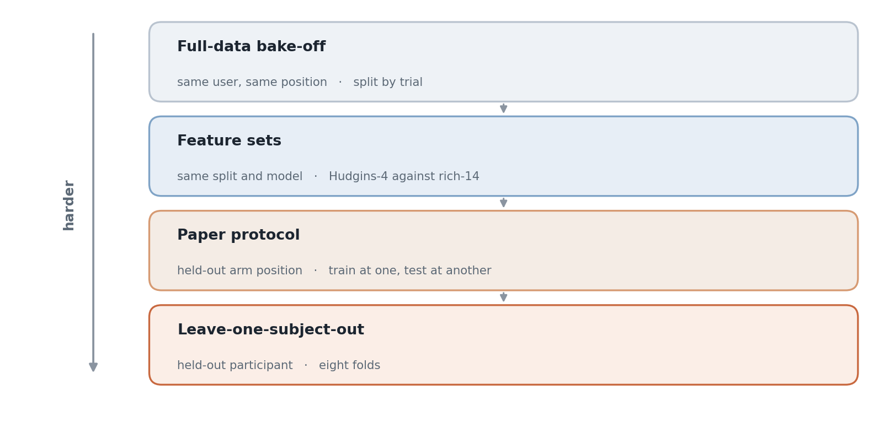

# sEMG Gesture Classifier

Yuhyeon Lee · 2026

[](https://github.com/blueion0612/sEMG_Gesture_Classifier/actions/workflows/tests.yml)
[](LICENSE)
[](https://www.python.org/)
[](#limitations)

[**Dataset**](docs/dataset.md) · [**Data DOI**](https://doi.org/10.5061/dryad.8sf7m0czv) · [**Source paper**](https://doi.org/10.1038/s41597-024-04296-8)

<picture>
  <source media="(prefers-color-scheme: dark)" srcset="docs/figures/hero_ladder-dark.png">
  
</picture>

**sEMG Gesture Classifier** compares classical machine learning on six-gesture
surface electromyography, using the public GREAT dataset. The point is not the
highest number: it is what happens to that number as the evaluation stops sharing a
user, a position and a session with the training set. Graduate coursework, 2026.

## Results

The pipeline recomputes everything from the recordings and writes
`results_main.json`. Nothing is cached in the repository, so the figures below are
what the code produces rather than numbers copied from a report.

| Evaluation | What is held out | Reference point |
|---|---|---|
| Full-data bake-off | windows of the same trial | KNN reaches about 98% |
| Feature sets | nothing; split and model fixed | Hudgins-4 (64) against rich-14 (224) |
| Paper protocol, within position | trial-grouped 5-fold | the paper reports about 96% |
| Paper protocol, across positions | the test arm position | the paper's naive transfer, 84 to 92% |
| Leave-one-subject-out | a whole participant, 8 folds | the strictest condition here |

Accuracy is reported with a 95% bootstrap confidence interval over 1000 resamples.
Where a comparison matters, significance is a Wilcoxon signed-rank test **over the
eight participants**, not over windows: windows from one trial are correlated, so a
window-level test would report significance that is not there.

**The trial is the unit that leaks.** Windows overlap by 78 ms, so two windows from
one trial are nearly the same measurement. Every split here keeps a whole trial on
one side. Without that, the bake-off number is meaningless.

**Boosting is represented by its histogram implementation.** Plain
`GradientBoosting` needs hours on the full set, so `HistGradientBoosting` stands in
for it, and `gb_vs_histgb_equivalence` checks on a subsample of the same split that
the two agree. The successor buys speed, not accuracy, and the repository shows that
rather than asserting it.

## Quick start

```bash
pip install -r requirements.txt
python -m semg.pipeline
```

The first run reads the raw dataset, extracts both feature sets and caches them as
`features_cache.npz`. Later runs load the cache and start immediately. Results are
printed and written to `results_main.json`.

## Method

**Windowing.** 128 ms windows, 256 samples at 2 kHz, with a 50 ms hop. That yields
470,413 windows over the 4,800 trials. The recordings arrive already bandpassed
between 20 and 450 Hz, so no further filtering is applied.

**Two feature sets.** Hudgins-4 is mean absolute value, zero crossings, slope sign
changes and waveform length: four per channel, 64 in total, and the baseline the
source paper used. Rich-14 adds RMS, Willison amplitude, variance, standard
deviation, interquartile range, mean absolute deviation, skewness, kurtosis, log
variance and simple square integral: 224 in total.

**Counting features need a threshold.** Zero crossings, slope sign changes and
Willison amplitude would otherwise count sensor noise. The threshold is 1% of each
channel's own standard deviation, so it adapts per channel rather than being a
global constant.

**Models.** Decision tree, random forest, AdaBoost, histogram gradient boosting, KNN,
logistic regression and a perceptron, plus a soft-voting ensemble of the three whose
errors differ most, and LDA as the paper's baseline. Hyperparameters are defaults
with `random_state=42` throughout, not a search. Scale-sensitive models sit inside a
pipeline with the scaler, so the scaler never sees the test fold.

## Usage

`python -m semg.pipeline` runs everything in order. The individual evaluations are
importable if you want one of them:

```python
from semg.features import load_features
from semg.evaluation import holdout_bakeoff, feature_set_comparison, paper_protocol, loso

data = load_features()
print(loso(data))
```

`DATA_DIR` at the top of `semg/features.py` points at the dataset. Change that one
line if it lives elsewhere.

## Repository layout

```
semg/
  features.py     windowing, time-domain features, caching
  models.py       the classifiers, the ensemble, the paper baseline
  eda.py          class balance, channel correlation, PCA, KMeans
  evaluation.py   the four evaluations and the metric helpers
  pipeline.py     entry point, runs all of it and writes the results
tests/            feature and model checks on synthetic signals
docs/
  dataset.md      source, licence, layout, recording protocol
  figures/        README figure and the script that draws it
```

## Tests

Ten tests on synthetic signals, so the dataset is not needed. They pin the window
geometry to 128 ms and 50 ms, check that the two feature sets are 64 and 224 wide,
verify that rich-14 contains the Hudgins four at their actual positions rather than
as a prefix, confirm that the amplitude threshold suppresses sub-threshold ripple in
the counting features, and check that every scale-sensitive model is wrapped with a
scaler.

```bash
pytest -q                       # if pytest is installed
python tests/test_features.py   # works without it
```

## Data

The GREAT dataset is on Dryad under CC0 at
[10.5061/dryad.8sf7m0czv](https://doi.org/10.5061/dryad.8sf7m0czv): 8 participants,
16 channels at 2 kHz, six gestures across nine arm positions, 4,800 trials.
[`docs/dataset.md`](docs/dataset.md) covers where to get it, how the folders are
named, what the gesture codes mean and how it was recorded.

Only `emg_data.hdf5` and `trials.csv` are read. The glove and finger recordings are
ignored.

## Limitations

- **Eight participants, all healthy adult males, right hand.** Nothing here says
  anything about anyone else.
- **Position transfer is the failure case**, and the dataset is built to expose it:
  only the centre position is shared between the two days.
- **No hyperparameter search.** Defaults throughout, so a tuned model would likely
  beat these numbers and the comparison between models is the point rather than any
  single value.
- **The report that accompanied this code contains extended tables** that a separate
  run produced, including a training-time benchmark and a subject-wise normalisation
  ladder. Those are not reproduced by `semg.pipeline` and are not in this
  repository.

## Citation

Cite the dataset and its paper, not this repository:

```bibtex
@article{kyranou2025great,
  author  = {Kyranou, Iris and Szymaniak, Katarzyna and Nazarpour, Kianoush},
  title   = {{EMG} Dataset for Gesture Recognition with Arm Translation},
  journal = {Scientific Data},
  volume  = {12},
  pages   = {100},
  year    = {2025},
  doi     = {10.1038/s41597-024-04296-8}
}
```

## Generative AI

Generative AI (Claude, Anthropic) was used as an assistant while writing this code
and the accompanying report: for drafting code, for help with debugging, and for
tidying documentation. The choice of topic and method, the experimental design, and
the running and checking of every number were done by the author.

## License

MIT. See [LICENSE](LICENSE). The dataset carries its own licence, CC0 1.0.
